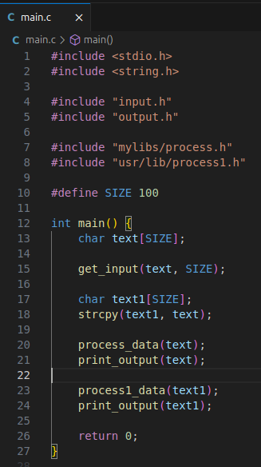
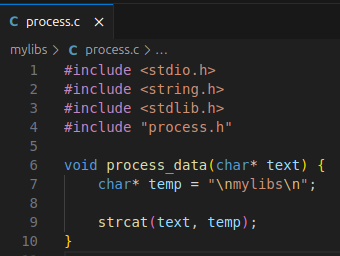
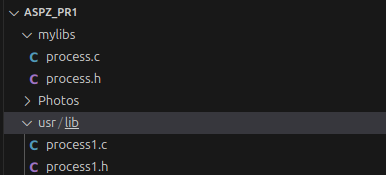
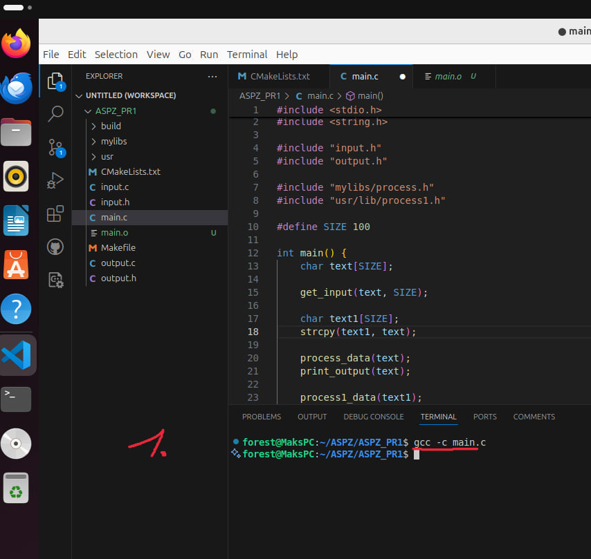
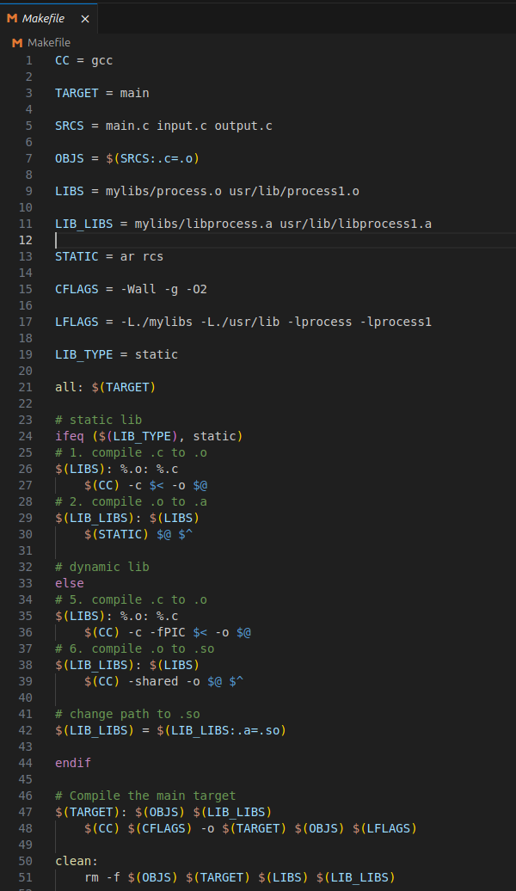
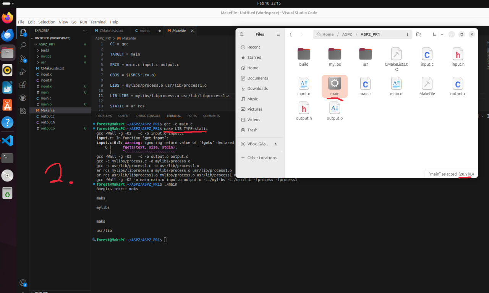
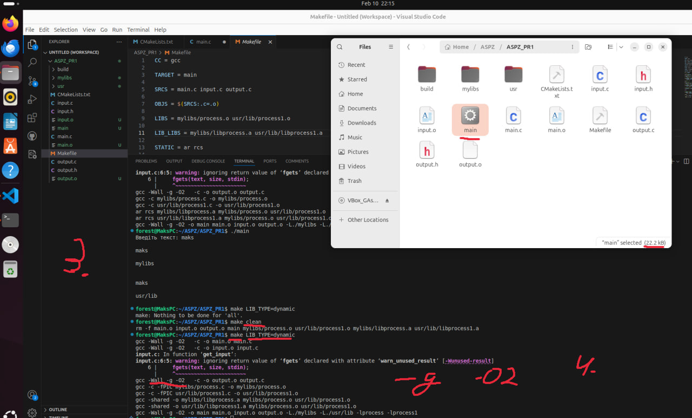
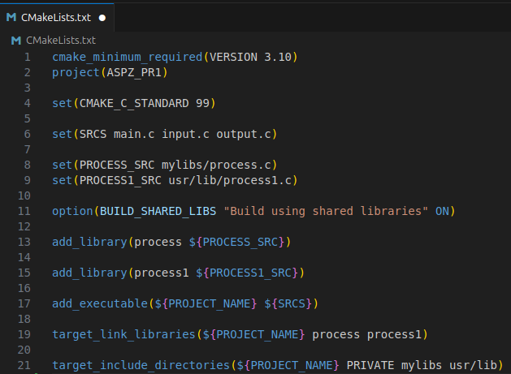
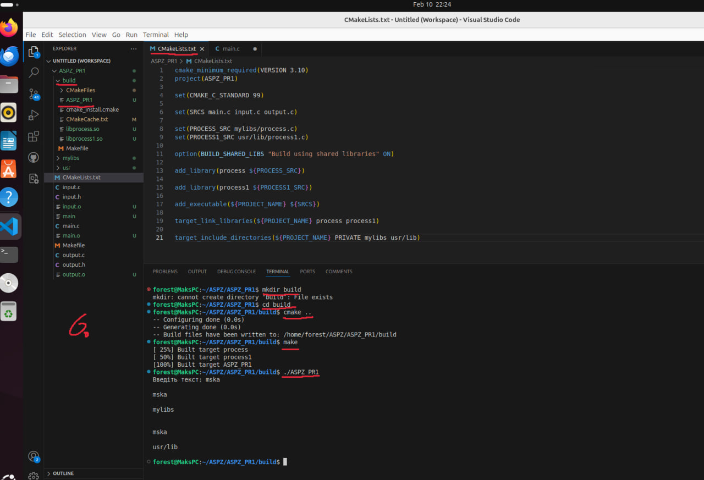

Цей проєкт демонструє процес компіляції програми на C з використанням `gcc`, створення та порівняння статичних і динамічних бібліотек, а також автоматизацію збірки за допомогою `Makefile` і `CMake`.

Для виконання цього завдання було написано простий код на мові програмування `C`, що буде отримувати текст від користувача й виводити його разомм з бібліотекою, що була викликана.

Ці дві бібліотеки будуть виводити своє місце розташування в залежності від того, яка бібліотека викликається.

Бібліотеки розташовані у папках `mylibs` та `usr/lib` відповідно.

Для компіляції програм використовується компілятор `gcc`

Далі було написано `Makefile` та `CMakeLists`.
У `Makefile` було використано змінні для зручності, а також користувач може обрати під час виклику, яку бібліотеку він бажає використати динамічну `LIB_TYPE=dynamic` чи статичну `LIB_TYPE=static`.

Також на фото нижчу можна побачити відмінність у розмірах файлу з бібліотеками. 
Це відбувається через те, що статична бібліотека компілюється разом із програмою, в той час, як динамічна завантажується під час виконання програми.

(В динамічній бібліотеці було використано додаткові аргументи `-g -O2`, через це файл вийшов більшим ніж коли використовувалась статична бібліотека. `-g` для відладки, а `-O2` для оптимізації)

**Статична:**

**Динамічна:** (`-g -O2`)

Також було написано `CMakeLists`.

Тут було додано всі необхідні бібліотеки та залежності, щоб правильно побудувати проект.

Початкові завдання до **3 варіанту**:

1. Написати команду компіляції з використанням gcc.
2. Змінити команду, щоб програма використовувала process1 із /usr/lib.
3. Змінити команду, щоб програма використовувала process із домашнього каталогу.
4. Додати прапорці для генерації налагоджувальної інформації (-g) і перевірки продуктивності (-O2).
5. Створити статичну (.a) і динамічну (.so) версії бібліотек process1 і process та перевірити різницю у виконанні.
6. gcc -c input.c output.c
7. gcc main.c input.o output.o -L/usr/lib -lprocess1 -L~/mylibs -lprocess -o my_program
8. Використовуйте Makefile для автоматизації процесу компіляції.
9. Додайте до Makefile ціль clean, яка видаляє .o файли та виконуваний файл.
10. Напишіть CMakeLists.txt для збирання програми за допомогою CMake.

**Завдання було виконанно, а результати сфотографовано та записано у папці Photos.** 

Деякі завдання було об'єднано для зручності
